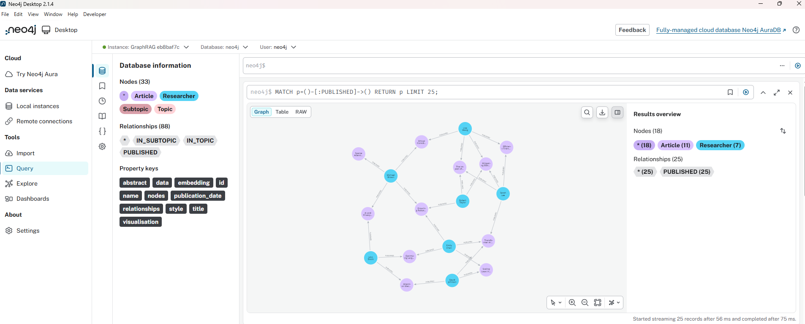
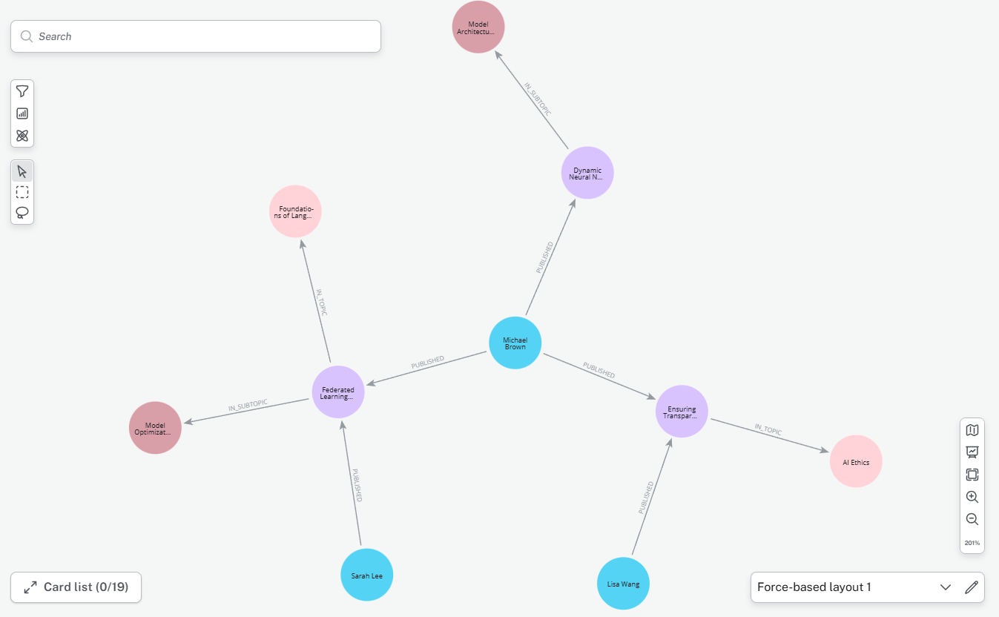

# GraphRAG: Hybrid Graph + Vector Retrieval System

A lightweight implementation of a **Graph-augmented Retrieval-Augmented Generation (GraphRAG)** system using **Neo4j**, **SentenceTransformers**, and vector similarity search.

This project combines:
- Semantic search (embeddings)
- Graph-based relationships (Neo4j)
- Hybrid retrieval and scoring



---

# Features

- Build a knowledge graph from structured CSV datasets
- Generate embeddings using `intfloat/multilingual-e5-base`
- Store and query data in Neo4j
- Semantic retrieval using cosine similarity
- Graph expansion via:
  - Authors
  - Topics
  - Subtopics
- Hybrid scoring system for ranking results

---

# Project Structure

```

GraphRAG/
│
├── dataset/
│ └── data.csv
│
├── build_graph.py
├── add_embeddings.py
├── graph_rag_retrieval.py
├── cosine_similarity.py
├── vector_search.py
├── test_neo4j.py
├── test_neo4j_.py
│
├── .gitignore
├── README.md
└── 

```

---

# Tech Stack

```
- Python 3.10+
- Neo4j 5.x
- SentenceTransformers
- NumPy
- Pandas
```

---

# Graph Model



---

# How It Works

## 1. Graph Construction

Nodes:
- Article
- Researcher
- Topic
- Subtopic

Graph Relationships:

```
(Researcher)-[:PUBLISHED]->(Article)
(Article)-[:IN_TOPIC]->(Topic)
(Article)-[:IN_SUBTOPIC]->(Subtopic)
```


---

## 2. Embedding Generation

Each article is embedded using:

```
intfloat/multilingual-e5-base
```


Embeddings are stored directly in Neo4j nodes.

---

## 3. Retrieval Pipeline

### Step 1: Vector Search
- Compute cosine similarity between query and article embeddings
- Retrieve Top-K most relevant articles

### Step 2: Graph Expansion
Expand selected articles using:
- Topics
- Subtopics
- Authors
- Related articles

### Step 3: Scoring
Final ranking is based on:

- Topic overlap
- Subtopic overlap
- Graph connectivity signals

---

# Example Usage

```
from graph_rag_retrieval import graph_rag

graph_rag("AI safety and ethics")
```
Example Output

Query: AI safety and ethics

Top-K:
- Ethical Considerations in AI Development
- AI and Privacy: Balancing Innovation and Individual Rights
- Ensuring Robustness in AI Systems

FINAL CONTEXT:
Article: Ethical Considerations in AI Development
Authors: Michael Brown, Lisa Wang
Topics: AI Ethics

Environment Variables

Create a ```.env``` file in the root dir:

```
NEO4J_URI=bolt://localhost:7687
NEO4J_USERNAME=neo4j
NEO4J_PASSWORD=your_password
```

Installation

```
pip install neo4j sentence-transformers numpy pandas
```

Run Project

1. Build Graph

```
python build_graph.py
```

2. Add Embeddings

```
python add_embeddings.py
```

3. Run GraphRAG

```
python graph_rag_retrieval.py
```


